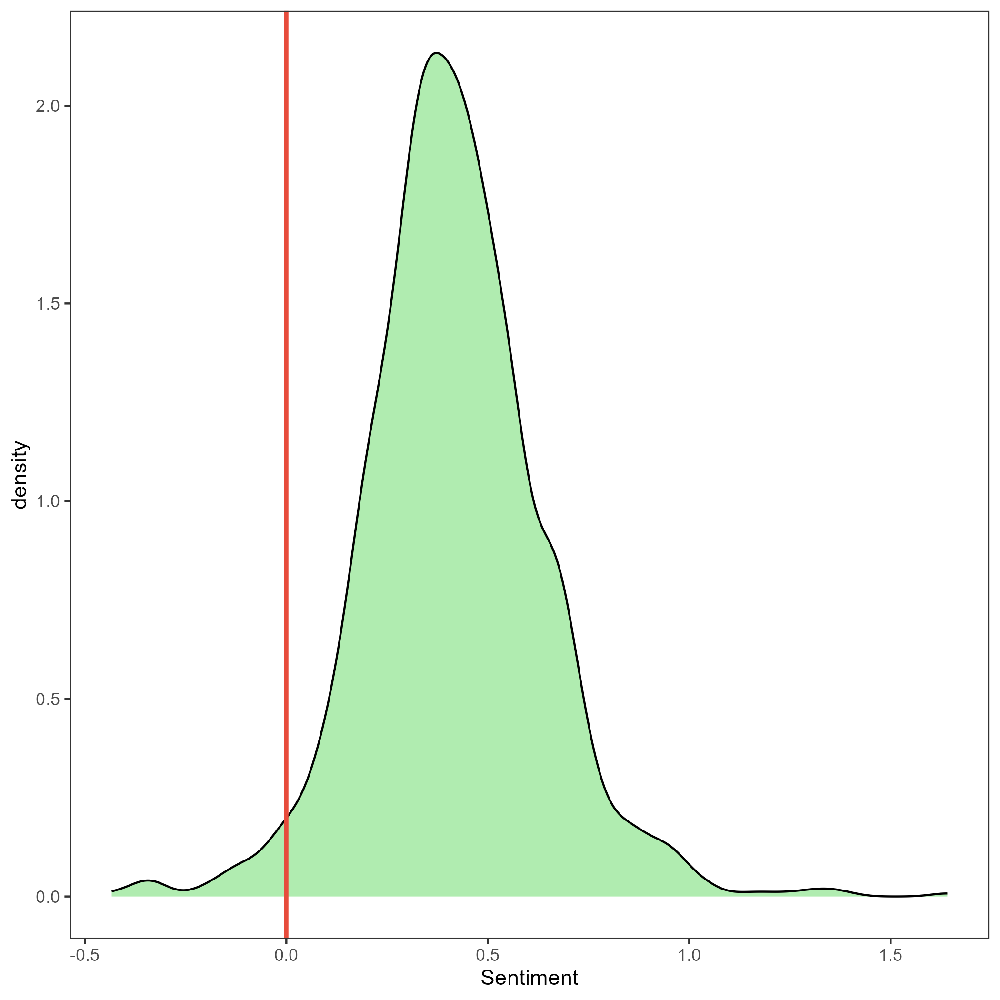
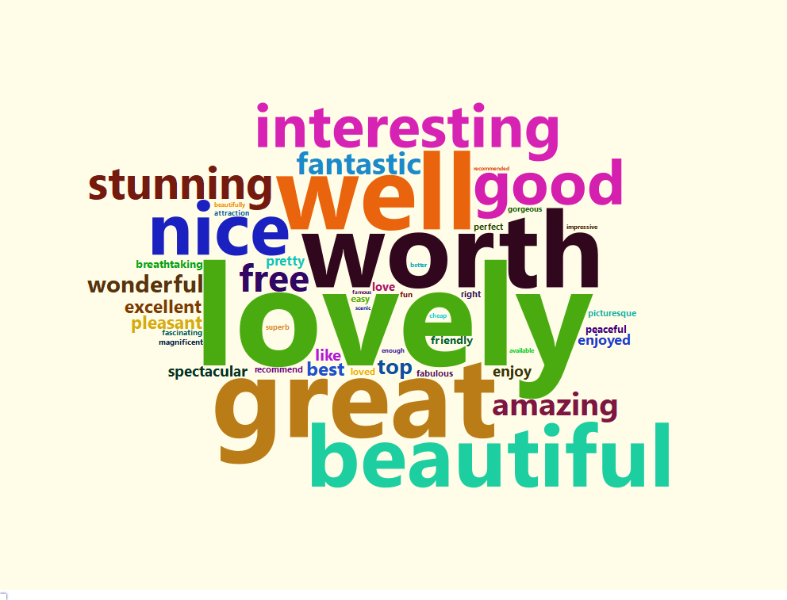
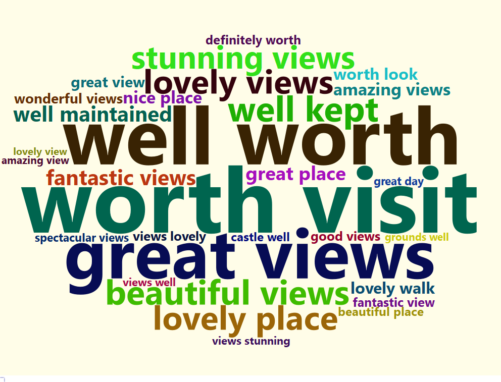
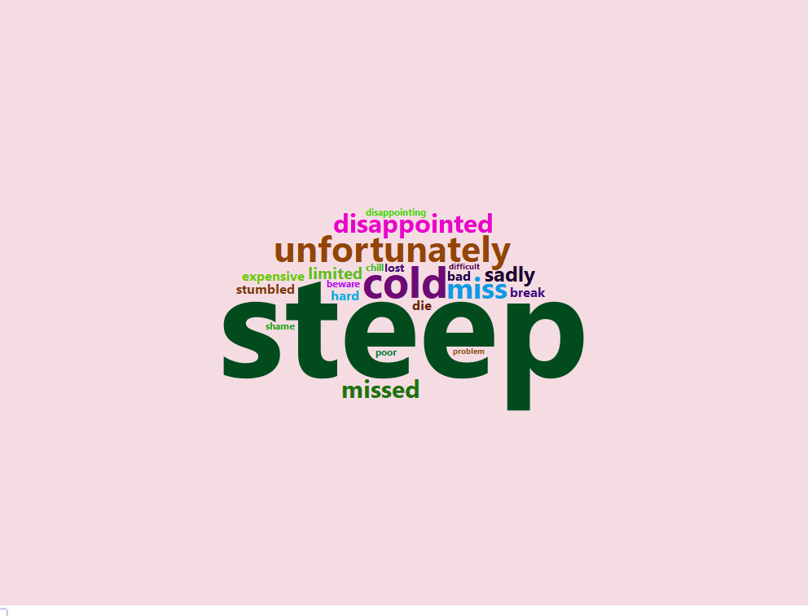
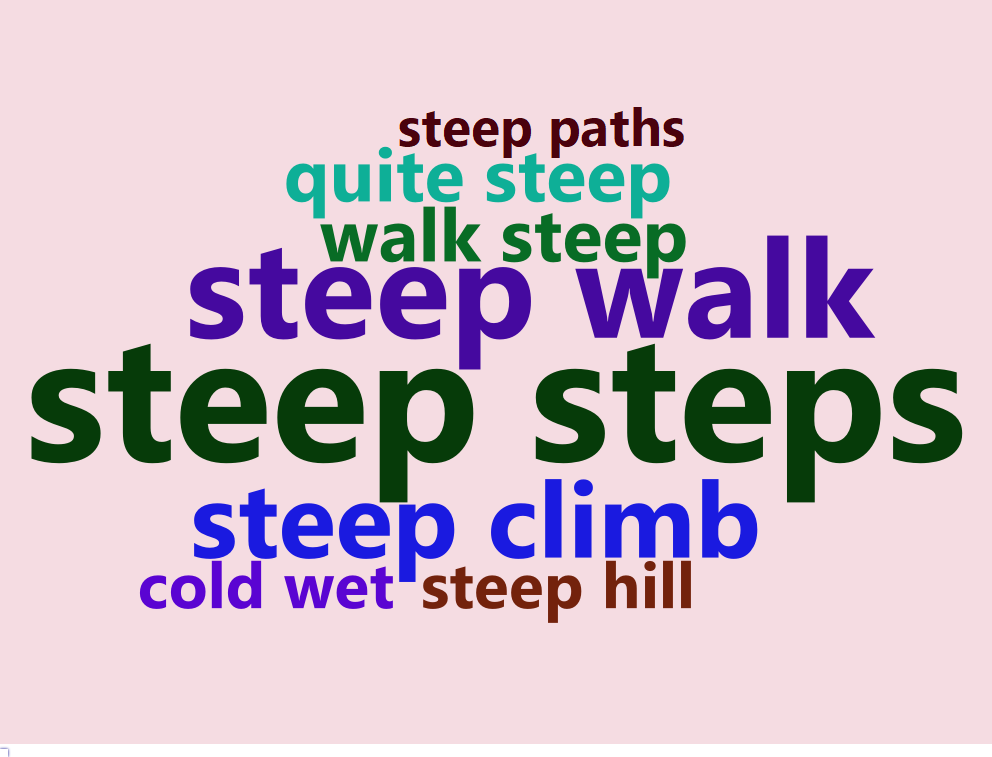

# Analysing TripAdvisor Reviews
As part of a work experience, I analysed the TripAdvisor reviews for 15 tourist attractions around Harrogate. This showcases my workflow using Knaresborough Castle as an example. The analysis was conducted in R and mainly uses the `RSelenium` and `rvest` packages for webscraping, as well as `sentimentr` and `quanteda` for text analysis. The sentiment analysis conducted applies a lexicon-based approach and uses an adjusted Bing sentiment lexicon, where sentiments for certain words were adjusted as they were used for different purposes in the context of the reviews.

Check out my <a href = "https://brendonkoh-portfolio.netlify.app/projects/analysing-tripadvisor-reviews/">website</a> for the full details on the rationale behind the analysis, the data cleaning process, and some discussion of the results.

To collect the data needed, I first scraped the TripAdvisor webpage and I've uploaded the reviews I scraped on 9 August 2022 for Knaresborough Castle (reviews_9 Aug 2022). With these reviews, I conducted sentiment analysis using `sentimentr` to calculate the polarities of the reviews and plotted a distribution to get an overview of visitors' general perceptions towards the attraction.

</img>

To better understand what exactly visitors liked or didn't like about the attractions, I then visualised the most frequently occurring positive and negative words and two-word phrases(bigrams) across all reviews collected.

  
&nbsp; &nbsp; &nbsp; &nbsp;
  

  
&nbsp; &nbsp; &nbsp; &nbsp;
  

